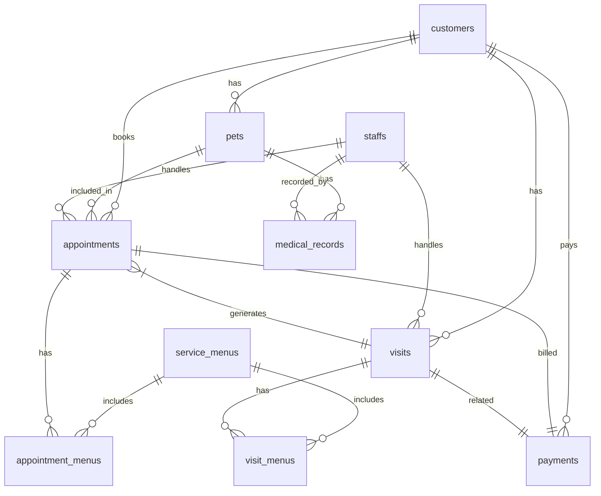

# Supabase テーブル設計 (ER図相当)

## 概要

SupabaseのPostgreSQLデータベースに以下のテーブルを設計します。各テーブルは、トリミングサロンの業務管理に必要な顧客、ペット、予約、カルテ、来店履歴などの情報を管理します。

## テーブル一覧

### 0. `service_menus` テーブル

*   **説明**: 施術メニューのマスタデータを管理します。
*   **リレーション**: `appointment_menus` と1対多、`visit_menus` と1対多。

| カラム名       | データ型      | 制約・備考                           | 説明                                 |
| :------------- | :------------ | :----------------------------------- | :----------------------------------- |
| `id`           | `uuid`        | `PRIMARY KEY`, `DEFAULT gen_random_uuid()` | メニューID                           |
| `created_at`   | `timestampz`  | `DEFAULT now()`                      | 作成日時                             |
| `updated_at`   | `timestampz`  | `DEFAULT now()`                      | 更新日時                             |
| `name`         | `text`        | `NOT NULL`                           | メニュー名                           |
| `category`     | `text`        | `NULLABLE`                           | カテゴリ（シャンプー/カット/オプションなど） |
| `price`        | `numeric`     | `NOT NULL`                           | 価格                                 |
| `duration`     | `integer`     | `NOT NULL`                           | 所要時間(分)                         |
| `tax_rate`     | `numeric`     | `DEFAULT 0.1`                        | 税率（0.1 = 10%）                    |
| `tax_included` | `boolean`     | `DEFAULT true`                       | 税込価格かどうか                     |
| `is_active`    | `boolean`     | `DEFAULT true`                       | 有効/無効フラグ                       |
| `display_order`| `integer`     | `DEFAULT 0`                          | 表示順                               |
| `notes`        | `text`        | `NULLABLE`                           | 説明文                               |

### 1. `customers` テーブル

*   **説明**: 顧客情報を管理します。
*   **リレーション**: `pets` テーブルと1対多（1顧客に複数ペット）、`appointments` テーブルと1対多、`visits` テーブルと1対多。

| カラム名       | データ型      | 制約・備考                           | 説明                                 |
| :------------- | :------------ | :----------------------------------- | :----------------------------------- |
| `id`           | `uuid`        | `PRIMARY KEY`, `DEFAULT gen_random_uuid()` | 顧客ID                               |
| `created_at`   | `timestampz`  | `DEFAULT now()`                      | 作成日時                             |
| `updated_at`   | `timestampz`  | `DEFAULT now()`                      | 更新日時                             |
| `user_id`      | `uuid`        | `REFERENCES auth.users(id)`          | 顧客情報を登録したSupabase AuthユーザーID (管理者用) |
| `full_name`    | `text`        | `NOT NULL`                           | 氏名                                 |
| `address`      | `text`        | `NULLABLE`                           | 住所                                 |
| `phone_number` | `text`        | `NULLABLE`                           | 電話番号                             |
| `email`        | `text`        | `NULLABLE`, `UNIQUE`                 | メールアドレス                       |
| `line_id`      | `text`        | `NULLABLE`, `UNIQUE`                 | LINE ID                              |
| `how_to_know`  | `text`        | `NULLABLE`                           | 来店経路                             |
| `tags`         | `text[]`      | `NULLABLE`                           | タグ（噛む傾向、皮膚弱いなど）           |

### 2. `pets` テーブル

*   **説明**: ペット情報を管理します。
*   **リレーション**: `customers` テーブルと多対1、`appointments` テーブルと多対1、`medical_records` テーブルと1対多。

| カラム名       | データ型      | 制約・備考                           | 説明                                 |
| :------------- | :------------ | :----------------------------------- | :----------------------------------- |
| `id`           | `uuid`        | `PRIMARY KEY`, `DEFAULT gen_random_uuid()` | ペットID                             |
| `created_at`   | `timestampz`  | `DEFAULT now()`                      | 作成日時                             |
| `updated_at`   | `timestampz`  | `DEFAULT now()`                      | 更新日時                             |
| `customer_id`  | `uuid`        | `NOT NULL`, `REFERENCES customers(id)` | 顧客ID                               |
| `name`         | `text`        | `NOT NULL`                           | 名前                                 |
| `breed`        | `text`        | `NULLABLE`                           | 犬種                                 |
| `gender`       | `text`        | `NULLABLE`                           | 性別（オス、メス）                   |
| `date_of_birth`| `date`        | `NULLABLE`                           | 生年月日                             |
| `weight`       | `numeric`     | `NULLABLE`                           | 体重 (kg)                            |
| `vaccine_date` | `date`        | `NULLABLE`                           | 最終ワクチン接種日                   |
| `chronic_diseases` | `text[]` | `NULLABLE`                           | 持病（配列）                         |
| `notes`        | `text`        | `NULLABLE`                           | 注意事項（噛む、高齢犬など）           |

### 3. `appointments` テーブル

*   **説明**: 予約情報を管理します。
*   **リレーション**: `customers` テーブルと多対1、`pets` テーブルと多対1、`staffs` テーブルと多対1。

| カラム名       | データ型      | 制約・備考                           | 説明                                 |
| :------------- | :------------ | :----------------------------------- | :----------------------------------- |
| `id`           | `uuid`        | `PRIMARY KEY`, `DEFAULT gen_random_uuid()` | 予約ID                               |
| `created_at`   | `timestampz`  | `DEFAULT now()`                      | 作成日時                             |
| `updated_at`   | `timestampz`  | `DEFAULT now()`                      | 更新日時                             |
| `customer_id`  | `uuid`        | `NOT NULL`, `REFERENCES customers(id)` | 顧客ID                               |
| `pet_id`       | `uuid`        | `NOT NULL`, `REFERENCES pets(id)`    | ペットID                             |
| `staff_id`     | `uuid`        | `NOT NULL`, `REFERENCES staffs(id)`  | 担当スタッフID                       |
| `start_time`   | `timestampz`  | `NOT NULL`                           | 予約開始日時                         |
| `end_time`     | `timestampz`  | `NOT NULL`                           | 予約終了日時                         |
| `menu`         | `text`        | `NOT NULL`                           | 予約メニュー                         |
| `duration`     | `integer`     | `NOT NULL`                           | 所要時間 (分)                        |
| `status`       | `text`        | `DEFAULT '予約済'`                  | 予約ステータス（予約済、来店済、キャンセル、無断キャンセル） |
| `notes`        | `text`        | `NULLABLE`                           | 予約に関する備考                     |

### 3.1 `appointment_menus` テーブル

*   **説明**: 予約に対して複数メニューを紐づける中間テーブル。
*   **リレーション**: `appointments` と多対1、`service_menus` と多対1。

| カラム名         | データ型      | 制約・備考                           | 説明                                 |
| :--------------- | :------------ | :----------------------------------- | :----------------------------------- |
| `id`             | `uuid`        | `PRIMARY KEY`, `DEFAULT gen_random_uuid()` | 中間ID                               |
| `created_at`     | `timestampz`  | `DEFAULT now()`                      | 作成日時                             |
| `appointment_id` | `uuid`        | `NOT NULL`, `REFERENCES appointments(id)` | 予約ID                               |
| `menu_id`        | `uuid`        | `NOT NULL`, `REFERENCES service_menus(id)` | メニューID                           |
| `menu_name`      | `text`        | `NOT NULL`                           | 予約時点のメニュー名（スナップショット） |
| `price`          | `numeric`     | `NOT NULL`                           | 予約時点の価格                       |
| `duration`       | `integer`     | `NOT NULL`                           | 予約時点の所要時間                   |
| `tax_rate`       | `numeric`     | `DEFAULT 0.1`                        | 予約時点の税率                       |
| `tax_included`   | `boolean`     | `DEFAULT true`                       | 予約時点の税込区分                   |

### 4. `staffs` テーブル

*   **説明**: スタッフ情報を管理します（予約時に担当者を選択するため）。
*   **リレーション**: `appointments` テーブルと1対多、`visits` テーブルと1対多。

| カラム名       | データ型      | 制約・備考                           | 説明                                 |
| :------------- | :------------ | :----------------------------------- | :----------------------------------- |
| `id`           | `uuid`        | `PRIMARY KEY`, `DEFAULT gen_random_uuid()` | スタッフID                           |
| `created_at`   | `timestampz`  | `DEFAULT now()`                      | 作成日時                             |
| `updated_at`   | `timestampz`  | `DEFAULT now()`                      | 更新日時                             |
| `full_name`    | `text`        | `NOT NULL`                           | 氏名                                 |
| `email`        | `text`        | `NULLABLE`, `UNIQUE`                 | メールアドレス                       |
| `user_id`      | `uuid`        | `REFERENCES auth.users(id)`          | Supabase AuthユーザーID (管理者/スタッフ紐付け) |
| `role`         | `text`        | `DEFAULT 'staff'`                    | 権限（admin / staff）                |

### 5. `visits` テーブル

*   **説明**: 来店履歴を管理します（予約情報から生成されることも想定）。
*   **リレーション**: `customers` テーブルと多対1、`appointments` テーブルと多対1（任意）、`staffs` テーブルと多対1。

| カラム名       | データ型      | 制約・備考                           | 説明                                 |
| :------------- | :------------ | :----------------------------------- | :----------------------------------- |
| `id`           | `uuid`        | `PRIMARY KEY`, `DEFAULT gen_random_uuid()` | 来店ID                               |
| `created_at`   | `timestampz`  | `DEFAULT now()`                      | 作成日時                             |
| `updated_at`   | `timestampz`  | `DEFAULT now()`                      | 更新日時                             |
| `customer_id`  | `uuid`        | `NOT NULL`, `REFERENCES customers(id)` | 顧客ID                               |
| `appointment_id` | `uuid`      | `NULLABLE`, `REFERENCES appointments(id)` | 予約ID（予約からの来店の場合）       |
| `staff_id`     | `uuid`        | `NOT NULL`, `REFERENCES staffs(id)`  | 担当スタッフID                       |
| `visit_date`   | `timestampz`  | `NOT NULL`                           | 来店日時                             |
| `menu`         | `text`        | `NOT NULL`                           | 施術メニュー                         |
| `total_amount` | `numeric`     | `NOT NULL`                           | 合計金額                             |
| `notes`        | `text`        | `NULLABLE`                           | 来店に関する備考                     |

### 5.1 `visit_menus` テーブル

*   **説明**: 来店履歴に紐づく施術メニューを管理します。
*   **リレーション**: `visits` と多対1、`service_menus` と多対1。

| カラム名       | データ型      | 制約・備考                           | 説明                                 |
| :------------- | :------------ | :----------------------------------- | :----------------------------------- |
| `id`           | `uuid`        | `PRIMARY KEY`, `DEFAULT gen_random_uuid()` | 中間ID                               |
| `created_at`   | `timestampz`  | `DEFAULT now()`                      | 作成日時                             |
| `visit_id`     | `uuid`        | `NOT NULL`, `REFERENCES visits(id)`  | 来店ID                               |
| `menu_id`      | `uuid`        | `NOT NULL`, `REFERENCES service_menus(id)` | メニューID                           |
| `menu_name`    | `text`        | `NOT NULL`                           | 来店時点のメニュー名                 |
| `price`        | `numeric`     | `NOT NULL`                           | 来店時点の価格                       |
| `duration`     | `integer`     | `NOT NULL`                           | 来店時点の所要時間                   |
| `tax_rate`     | `numeric`     | `DEFAULT 0.1`                        | 来店時点の税率                       |
| `tax_included` | `boolean`     | `DEFAULT true`                       | 来店時点の税込区分                   |

### 5.2 `payments` テーブル

*   **説明**: 会計情報を管理します（支払方法/ステータス/金額など）。
*   **リレーション**: `appointments` と1対1、`customers` と多対1、`visits` と1対1（会計完了時に紐づけ）。

| カラム名         | データ型      | 制約・備考                           | 説明                                 |
| :--------------- | :------------ | :----------------------------------- | :----------------------------------- |
| `id`             | `uuid`        | `PRIMARY KEY`, `DEFAULT gen_random_uuid()` | 会計ID                               |
| `created_at`     | `timestampz`  | `DEFAULT now()`                      | 作成日時                             |
| `updated_at`     | `timestampz`  | `DEFAULT now()`                      | 更新日時                             |
| `appointment_id` | `uuid`        | `NOT NULL`, `REFERENCES appointments(id)` | 予約ID                               |
| `customer_id`    | `uuid`        | `NOT NULL`, `REFERENCES customers(id)` | 顧客ID                               |
| `visit_id`       | `uuid`        | `NULLABLE`, `REFERENCES visits(id)`  | 来店ID（会計完了時に紐づけ）         |
| `status`         | `text`        | `DEFAULT '未払い'`                   | 支払ステータス（未払い/支払済）      |
| `method`         | `text`        | `DEFAULT '現金'`                     | 支払い方法（現金/カード/電子マネー等）|
| `subtotal_amount`| `numeric`     | `NOT NULL`                           | 小計金額                             |
| `tax_amount`     | `numeric`     | `NOT NULL`                           | 税額                                 |
| `discount_amount`| `numeric`     | `DEFAULT 0`                          | 割引額                               |
| `total_amount`   | `numeric`     | `NOT NULL`                           | 合計金額                             |
| `paid_at`        | `timestampz`  | `NULLABLE`                           | 支払完了日時                         |
| `notes`          | `text`        | `NULLABLE`                           | 会計備考                             |

### 6. `medical_records` テーブル

*   **説明**: ペットカルテ情報を管理します。
*   **リレーション**: `pets` テーブルと多対1、`staffs` テーブルと多対1。

| カラム名       | データ型      | 制約・備考                           | 説明                                 |
| :------------- | :------------ | :----------------------------------- | :----------------------------------- |
| `id`           | `uuid`        | `PRIMARY KEY`, `DEFAULT gen_random_uuid()` | カルテID                             |
| `created_at`   | `timestampz`  | `DEFAULT now()`                      | 作成日時                             |
| `updated_at`   | `timestampz`  | `DEFAULT now()`                      | 更新日時                             |
| `pet_id`       | `uuid`        | `NOT NULL`, `REFERENCES pets(id)`    | ペットID                             |
| `staff_id`     | `uuid`        | `NOT NULL`, `REFERENCES staffs(id)`  | 担当スタッフID                       |
| `record_date`  | `timestampz`  | `NOT NULL`                           | 施術日時                             |
| `menu`         | `text`        | `NOT NULL`                           | 施術メニュー                         |
| `duration`     | `integer`     | `NULLABLE`                           | 所要時間 (分)                        |
| `shampoo_used` | `text`        | `NULLABLE`                           | 使用シャンプー                       |
| `skin_condition` | `text`      | `NULLABLE`                           | 皮膚状態                             |
| `behavior_notes` | `text`      | `NULLABLE`                           | 問題行動（噛む、暴れるなど）           |
| `photos`       | `text[]`      | `NULLABLE`                           | 写真URL（Supabase Storageのパス）  |
| `caution_notes` | `text`      | `NULLABLE`                           | 注意事項（高齢犬、持病など）           |

## リレーションシップの概要

## RLS (Row Level Security) の考慮事項

SupabaseのRLSを活用し、以下のアクセス制御を実装することを推奨します。

*   `customers`: 管理者ユーザーのみがCRUD操作可能。一般スタッフは読み取りと自身の担当顧客のみCRUD操作可能。
*   `pets`: 管理者ユーザーのみがCRUD操作可能。一般スタッフは読み取りと自身の担当顧客のペットのみCRUD操作可能。
*   `appointments`: 管理者ユーザーおよび担当スタッフがCRUD操作可能。
*   `staffs`: 管理者ユーザーのみがCRUD操作可能。
*   `service_menus`: 管理者ユーザーのみがCRUD操作可能。一般スタッフは読み取りのみ。
*   `appointment_menus`: 管理者ユーザーおよび担当スタッフがCRUD操作可能。
*   `visits`: 管理者ユーザーおよび担当スタッフがCRUD操作可能。
*   `visit_menus`: 管理者ユーザーおよび担当スタッフがCRUD操作可能。
*   `payments`: 管理者ユーザーおよび担当スタッフがCRUD操作可能。
*   `medical_records`: 管理者ユーザーおよび担当スタッフがCRUD操作可能。

実際のRLSポリシーは、`auth.uid()` と `staffs` テーブルの連携、あるいはカスタムファンクションを使って実装します。
